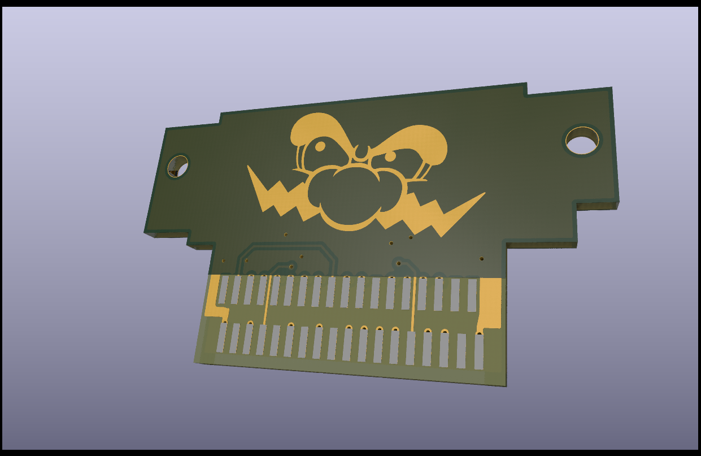
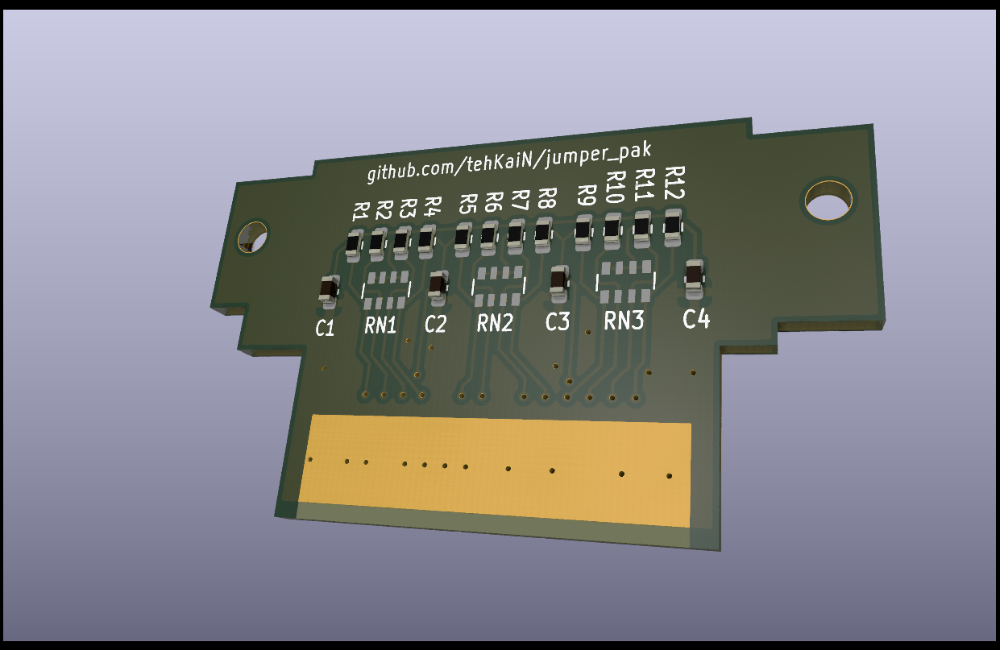

# Jumper Pak

This is an open-source Nintendo 64 Jumper Pak replacement.
Dimensions are captured from the original with caliper, with slight modifications.
Design is based on high resolution scans of the original and scraps of information found across the Internet.

I was commissioned to do this, and I don't have the actual hardware, but the project was tested by other people and proven to work.
The PCB contains the footprints for both resistor packs as well as single 0603 resistors.
**Don't solder both of them! Choose one type!**
